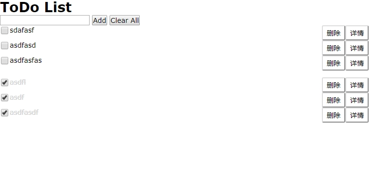

# ToDo List

项目截图：

可以访问 http://todo.life1st.cn 使用

没错，这又是一个简单的，烂大街的todo的玩具项目。

做这个的原因是在imooc上看了一门课程，看完的感觉是：就这？还能卖钱？那我也搞一个。

## 实现的功能

* 添加待办事项

* 分组区分`已完成事项`和`未完成事项`

## 其他

项目依赖 `JQuery` 和 [`store.js`](https://github.com/marcuswestin/store.js/)

国内访问可能有点慢。主要是store.js没有可用的cdn，又不想放在项目里，所以放在了美西的服务器上。